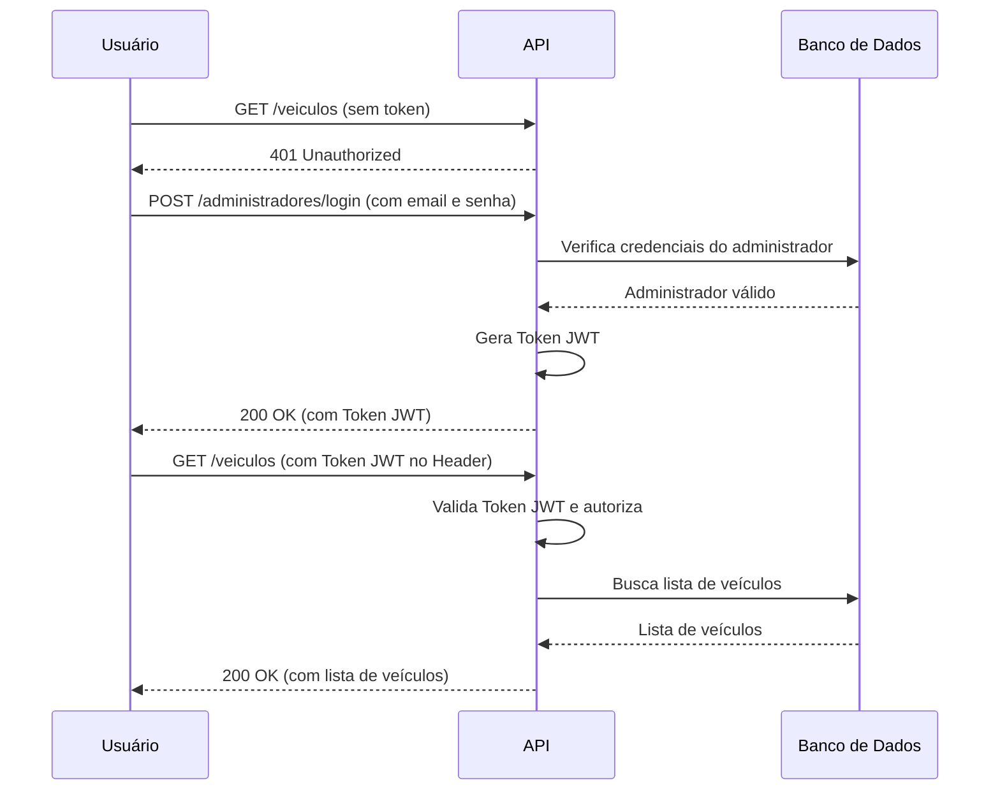

# Minimal API com .NET 7

Este é um projeto de exemplo de uma Minimal API construída com .NET 7, Entity Framework Core e autenticação JWT. A API gerencia um cadastro de veículos e administradores, com diferentes níveis de permissão.

## Tecnologias Utilizadas

- **.NET 7**: Framework para construção da aplicação.
- **Minimal API**: Abordagem simplificada para criar APIs HTTP no .NET.
- **Entity Framework Core**: ORM para interação com o banco de dados.
- **MySQL**: Banco de dados relacional utilizado no projeto.
- **JWT (JSON Web Tokens)**: Para autenticação e autorização baseada em tokens.
- **Swagger/OpenAPI**: Para documentação e teste interativo da API.
- **MSTest**: Para os testes de integração da API.

## Funcionalidades

- Autenticação de usuários (Administradores).
- Geração de Token JWT para acesso aos endpoints protegidos.
- Autorização baseada em Roles (`Adm`, `Editor`).
- CRUD completo para a entidade `Veiculo`.
- CRUD para a entidade `Administrador`.

## Fluxo de Autenticação e Acesso

O diagrama abaixo ilustra o fluxo principal da aplicação: um usuário tenta acessar um recurso protegido, falha, realiza a autenticação para obter um token JWT e, em seguida, utiliza o token para acessar o recurso com sucesso.



## Como Executar o Projeto

### Pré-requisitos

- .NET 7 SDK
- Um servidor MySQL em execução.
- Um cliente de banco de dados como DBeaver, DataGrip ou MySQL Workbench.

### 1. Clone o Repositório

```bash
git clone <url-do-seu-repositorio>
cd minimal-api
```

### 2. Configure o Banco de Dados

1. Crie um novo banco de dados (schema) no seu servidor MySQL. O nome padrão utilizado no projeto é `minimal_api`.
2. Importe o arquivo `Test/minimal_api.dump.sql` para o seu banco de dados. Isso criará as tabelas e inserirá os dados iniciais necessários para testar a aplicação.

   **Usuários iniciais:**
   - **Email:** `administrador@teste.com`, **Senha:** `123456`, **Perfil:** `Adm`
   - **Email:** `joao@teste.com`, **Senha:** `editor`, **Perfil:** `Editor`

3. No diretório `Api/`, renomeie ou crie o arquivo `appsettings.Development.json` e adicione sua string de conexão com o MySQL.

   **`Api/appsettings.Development.json`**
   ```json
   {
     "Logging": {
       "LogLevel": {
         "Default": "Information",
         "Microsoft.AspNetCore": "Warning"
       }
     },
     "ConnectionStrings": {
       "MySql": "Server=localhost;Port=3306;Database=minimal_api;Uid=root;Pwd=sua_senha;"
     },
     "Jwt": "SUA_CHAVE_SECRETA_PARA_GERAR_O_TOKEN_JWT"
   }
   ```
   > **Importante:** Substitua `sua_senha` pela senha do seu usuário root do MySQL e defina uma chave secreta forte para o campo `Jwt`.

### 3. Execute a API

Navegue até a pasta da API e execute o comando:

```bash
cd Api
dotnet run
```

A API estará em execução. Por padrão, você pode acessá-la em `http://localhost:5000` ou `https://localhost:5001`.

### 4. Acesse a Documentação (Swagger)

Com a API em execução, abra seu navegador e acesse a URL do Swagger para explorar e testar os endpoints:

`http://localhost:5000/swagger`

## Como Executar os Testes

Para executar os testes de integração, navegue até a pasta de testes e execute o comando:

```bash
cd Test
dotnet test
```

## Endpoints da API

### Autenticação
- `POST /administradores/login`: Realiza o login e retorna um token JWT. (Aberto)

### Administradores
- `GET /administradores`: Lista todos os administradores. (Requer perfil `Adm`)
- `GET /administradores/{id}`: Busca um administrador por ID. (Requer perfil `Adm`)
- `POST /administradores`: Cria um novo administrador. (Requer perfil `Adm`)

### Veículos
- `GET /veiculos`: Lista todos os veículos. (Requer autenticação)
- `GET /veiculos/{id}`: Busca um veículo por ID. (Requer perfil `Adm` ou `Editor`)
- `POST /veiculos`: Cria um novo veículo. (Requer perfil `Adm` ou `Editor`)
- `PUT /veiculos/{id}`: Atualiza um veículo existente. (Requer perfil `Adm`)
- `DELETE /veiculos/{id}`: Remove um veículo. (Requer perfil `Adm`)

## Autenticação

1.  Para acessar os endpoints protegidos, primeiro faça uma requisição `POST` para `/administradores/login` com o email e senha de um usuário cadastrado.
2.  A API retornará um token JWT.
3.  Para as próximas requisições, inclua este token no cabeçalho (Header) `Authorization` com o prefixo `Bearer`.

    **Exemplo:** `Authorization: Bearer seu_token_jwt_aqui`

    No Swagger, você pode clicar no botão "Authorize" e colar o token para que ele seja enviado em todas as requisições subsequentes.